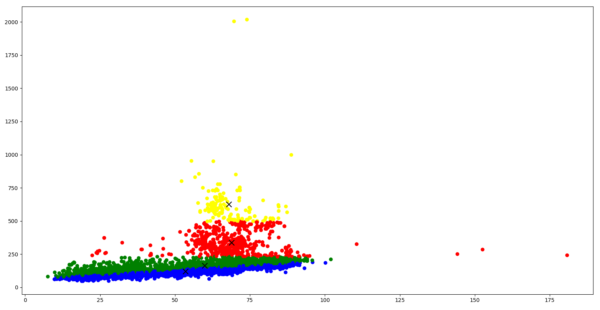

# DistributedKNN: Distributed K-Means Clustering with MPI

## Project Description

The "Distributed K-Means Clustering with MPI" project showcases a parallel implementation of the K-Means clustering algorithm using MPI (Message Passing Interface). The project aims to leverage the power of distributed computing to perform efficient clustering on large datasets.

## Background

Clustering is a fundamental technique in unsupervised machine learning that groups similar data points together based on their attributes. The K-Means algorithm is a popular clustering algorithm that assigns data points to clusters by minimizing the sum of squared distances between data points and their respective cluster centroids. However, the K-Means algorithm can be computationally expensive, especially when dealing with large datasets.

To overcome the computational challenges and enhance the performance of K-Means clustering, the project utilizes MPI, a widely-used library for message passing parallel programming. MPI enables the distribution of computation across multiple processors or computing nodes, allowing for efficient parallel processing of data.

## Project Details

The "Distributed K-Means Clustering with MPI" project provides the following key features:

### 1. Parallel Implementation of K-Means Clustering

The project implements the K-Means clustering algorithm using MPI to achieve parallel processing. By dividing the dataset across multiple ranks (processes), the algorithm can perform simultaneous computations on different subsets of data. Each rank computes local centroids and exchanges information with other ranks to update the global centroids iteratively.

### 2. Dynamic Assignment of Data Points to Clusters

The implementation supports dynamic assignment of data points to clusters during the iterative process. Each data point is assigned to the cluster with the closest centroid based on distance calculations. This dynamic assignment ensures optimal clustering results even when the data distribution is non-uniform.

### 3. Performance Analysis and Scalability

The project provides the capability to experiment with different numbers of ranks (processes) to analyze the performance and scalability of the distributed K-Means clustering algorithm. By varying the number of ranks, users can observe the impact on execution time and evaluate the speedup achieved by parallel processing.

### 4. Visualization of Clustering Results

After the clustering process completes, the project visualizes the clustering results using matplotlib. It generates a scatter plot of the data points, where each point is colored based on its assigned cluster. Additionally, the final centroids for each cluster are marked with black X symbols.

## Project Results
The experiments were carried out using a dataset that contains over 7000 instances of smartphone weights and screen-to-body ratios. The datapoints were clustered into 4 groups, and the experiment was carried out using an increasing number of ranks (processors). The results show significant speed-up compared to running the program sequentially. 

The following results are available:

- **Visualization of Clustering Results**: 
- **Execution times for different numbers of ranks**: 
- **Source Code**: [distributed_knn.py](./distributed_knn.py)

## Prerequisites

To run the code for the "Distributed K-Means Clustering with MPI" project, the following prerequisites are required:

- Python (version 3.6 or above)
- pandas
- matplotlib
- numpy
- mpi4py

You can install the required packages using the following command:

```
pip install pandas matplotlib numpy mpi4py
```

## How to Run the Code

To execute the code for the "Distributed K-Means Clustering with MPI" project, follow these steps:

1. Clone the project repository from GitHub: [Link to Repository](https://github.com/your-username/your-repository)

2. Navigate to the project directory.

3. Ensure that the `cluster_data.csv` file is present in the project directory. This file contains the data to be clustered.

4. Open a terminal or command prompt and navigate to the project directory.

5. Run the following command to execute the code:

```
mpiexec -n <num_ranks> python distributed_knn.py
```

Replace `<num_ranks>` with the required number of ranks.
